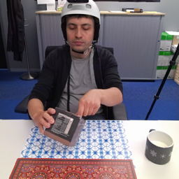
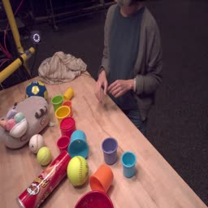
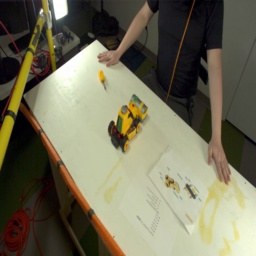
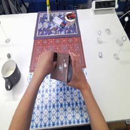
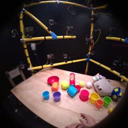
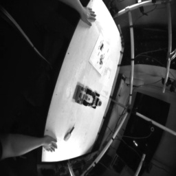
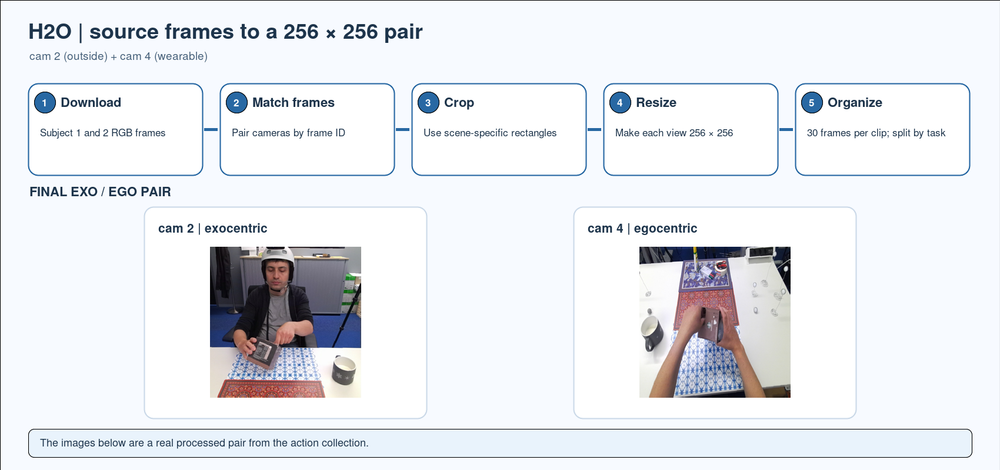
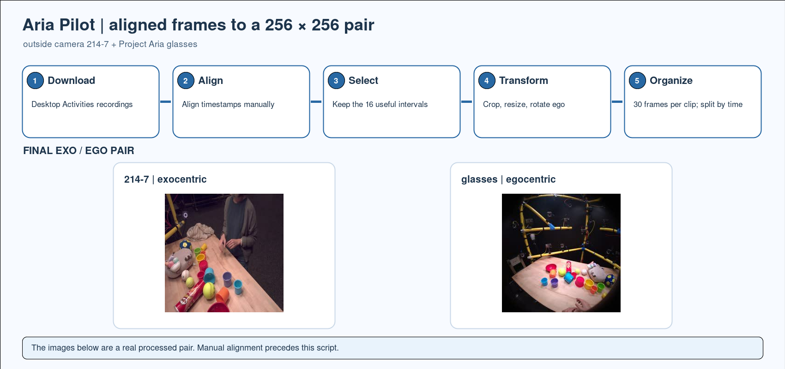
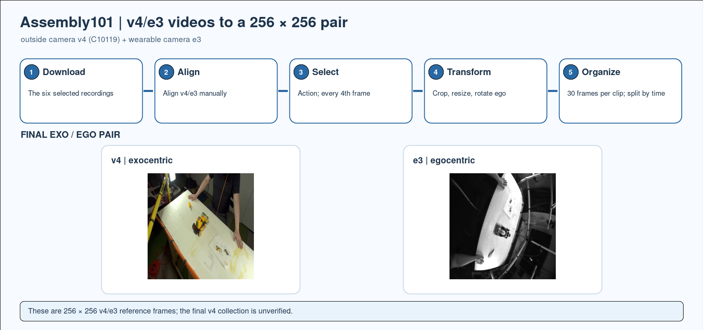

# Exo2Ego Benchmark

## 1. Repository introduction

This release documents the **Exo-to-Ego View Translation** benchmark in [*Put Myself in Your Shoes: Lifting the Egocentric Perspective from Exocentric Videos* (ECCV 2024)](https://www.ecva.net/papers/eccv_2024/papers_ECCV/papers/05558.pdf). 

The task is to infer the actor's first-person view from a synchronized outside-camera video. The selected source views are H2O **cam 2**, Aria Pilot **214-7**, and Assembly101 **v4**; their corresponding target views are H2O **cam 4**, Project Aria glasses, and Assembly101 **e3**. The paper crops each view to **256 × 256** and organizes paired frames into **30-frame clips**. H2O contributes two-handed interactions with eight objects, Aria Pilot contributes 16 desktop recordings, and Assembly101 contributes six toy-roller recordings from five actors.

| View | H2O | Aria Pilot | Assembly101 |
| --- | --- | --- | --- |
| Exocentric view |  |  |  |
| Egocentric view |  |  |  |

H2O and Aria examples are paired images from the finished 256 × 256 action folders. Assembly101 shows the 256 × 256 **v4/e3 reference frames** at the same frame number; the v4 final pix2pix folder has not been generated or verified.

## 2. Source dataset preparation

Download the recordings from the dataset owners. Source videos and frames are not included in this release.

| Dataset | Download | Required source views |
| --- | --- | --- |
| H2O | [ETH Zurich registration and download](https://h2odataset.ethz.ch/) | Subject 1 and 2 RGB frames from cam 2 and cam 4 |
| Aria Pilot Desktop Activities | [Project Aria Pilot documentation](https://facebookresearch.github.io/Aria_data_tools/docs/pilotdata/pilotdata-index/) | The 16 original Desktop Activities recordings; Aria glasses and outside camera 214-7 |
| Assembly101 | [Official download scripts](https://github.com/assembly-101/assembly101-download-scripts) | v4 `C10119_rgb.mp4` and e3 HMC video for the six recordings below |

The Assembly101 recording IDs are:

```text
nusar-2021_action_both_9051-c13a_9051_user_id_2021-02-22_121941
nusar-2021_action_both_9056-c13a_9056_user_id_2021-02-22_145733
nusar-2021_action_both_9071-c13a_9071_user_id_2021-02-11_090900
nusar-2021_action_both_9081-c13a_9081_user_id_2021-02-12_162453
nusar-2021_action_both_9086-c13a_9086_user_id_2021-02-16_151024
nusar-2021_action_both_9086-c13a_9086_user_id_2021-02-16_152408
```

The download formats differ. H2O provides camera frame directories; Assembly101 provides one video per camera and recording; Aria Pilot requires camera-frame extraction and manual alignment before `sync/exo` and `sync/ego` pairs exist. The processing script expects these layouts:

```text
H2O/subject1/h1/0/cam2/rgb/000001.png
H2O/subject1/h1/0/cam4/rgb/000001.png
Assembly101/videos/<recording>/C10119_rgb.mp4
Assembly101/videos/<recording>/HMC_84355350_mono10bit.mp4  # or HMC_21110305_mono10bit.mp4
aria_pilot/<activity>/<recording>/sync/exo/<matched-index>_214-7-....jpg
aria_pilot/<activity>/<recording>/sync/ego/<matched-index>_....jpg
```

## 3. Dataset processing

For each recording, select the views above, align the two streams in time, keep the useful activity intervals, crop each view around the action, and resize to **256 × 256**. Divide the result into **30-frame clips**, apply the evaluation split, and keep the corresponding outside/first-person frames paired.

The standalone [image preparation script](prepare_images.py) processes H2O source frames, Aria's already aligned frame folders, or Assembly101 videos with an explicit manual alignment CSV. It creates paired images and a frame index.

The processing code is organized by dataset: [H2O](preprocessing/h2o.py) defines its four splits and camera crops, [Aria](preprocessing/aria.py) selects aligned activity intervals, and [Assembly101](preprocessing/assembly101.py) reads manually matched v4/e3 frames. [Shared processing](preprocessing/common.py) handles frame pairing, 30-frame clips, cropping, resizing, and output names. `prepare_images.py` is the command-line entry point.

From this folder, install its [requirements](requirements.txt):

```bash
python -m pip install -r requirements.txt
```

H2O pairs cam 2 and cam 4 by frame ID and applies the bundled [scene crops](configs/h2o_crops.json). Run each setting separately:

```bash
python prepare_images.py h2o --input /data/H2O --output output/h2o_action --setting action
python prepare_images.py h2o --input /data/H2O --output output/h2o_object --setting object
python prepare_images.py h2o --input /data/H2O --output output/h2o_subject --setting subject
python prepare_images.py h2o --input /data/H2O --output output/h2o_scene --setting scene
```

For Aria, first extract and manually align the 214-7 camera and glasses frames into `sync/exo` and `sync/ego` directories. Corresponding filenames must start with the same numeric pair index. The script then applies the bundled [16 activity intervals](configs/aria_intervals.json), crops and resizes the images, and rotates the glasses view:

```bash
python prepare_images.py aria --input /data/aria_pilot --output output/aria_action
```

The Aria intervals select useful activity; they are not synchronization offsets. The historical manual alignment parameters are unavailable.

For Assembly101, use the six recordings above. The historical process aligned v4/e3 streams manually, selected activity intervals, and sampled every fourth frame before cropping and resizing. Supply the resulting frame choices as `alignment.csv`, with exactly 30 rows per `(recording,segment,clip,split)` group in frame order. The required columns are `recording,segment,clip,split,exo_frame,ego_frame`; `split` is `training` or `testing`. Supply a JSON crop file keyed by recording ID, with `exo` and `ego` rectangles in `[width,height,left,top]` order. These example values show the format only; they are not recovered historical parameters:

```csv
recording,segment,clip,split,exo_frame,ego_frame
nusar-2021_action_both_9051-c13a_9051_user_id_2021-02-22_121941,seq0,0,training,152,152
```

```json
{
  "nusar-2021_action_both_9051-c13a_9051_user_id_2021-02-22_121941": {
    "exo": [1920, 1080, 0, 0],
    "ego": [636, 480, 0, 0]
  }
}
```

```bash
python prepare_images.py assembly101 --input /data/Assembly101/videos --alignment alignment.csv --crops crops.json --output output/assembly_action
```

The output contains `training/exo`, `training/ego`, `testing/exo`, `testing/ego`, and `pairs.csv`. Matching exo/ego frames have identical filenames. Add `--dry-run` to check clip counts without writing images. **A clip contains 30 frames, not 30 seconds.**


| H2O | Aria Pilot | Assembly101 |
| --- | --- | --- |
| [](assets/h2o_flow.png) | [](assets/aria_flow.png) | [](assets/assembly_v4_flow.png) |

The historically inspected image collections have 30 image pairs per paper clip and match the counts below. The H2O subject collection contains only subject-2 test images. The inspected Assembly101 exocentric images are **v1** despite the paper specifying v4; they are not a verified paper-view artifact. The historical collections are not distributed here. Matching counts do not establish camera or synchronization correctness. Exact Assembly101 reproduction requires the missing manual frame mapping and verified v4 crop choices.

## 4. Evaluation

The benchmark evaluates **new actions** on H2O, Aria Pilot, and Assembly101. H2O also supports **new objects**, **new subjects**, and **new scenes**. The counts are from [Section 4.1 of the ECCV paper](https://www.ecva.net/papers/eccv_2024/papers_ECCV/papers/05558.pdf).

| Dataset | Setting | Train clips | Test clips | Split |
| --- | --- | ---: | ---: | --- |
| H2O | New actions | 704 | 199 | Earlier → later clips in each video |
| Aria Pilot | New actions | 343 | 95 | Earlier → later clips in each recording |
| Assembly101 | New actions | 682 | 205 | Earlier → later clips in each recording |
| H2O | New objects | 691 | 108 | Objects 0–5 → object 7; object 6 excluded |
| H2O | New subjects | 704 | 194 | Subject 1 → subject 2 |
| H2O | New scenes | 591 | 312 | h1/h2/k1/k2 → o1/o2 |

Pair every generated egocentric image with the ground-truth egocentric image for the same test frame. Evaluate all methods on the same test-frame list at 256 × 256 resolution.

| Metric | What it measures | Computation | Better |
| --- | --- | --- | --- |
| **SSIM** (Structural Similarity Index) | Pixel-level structural similarity | Compute per matched image pair, then average over test frames | Higher |
| **PSNR** (Peak Signal-to-Noise Ratio) | Pixel-level reconstruction fidelity, in dB | Compute per matched image pair, then average over test frames | Higher |
| **FID** (Fréchet Inception Distance) | Similarity of generated and real image distributions | Compute once over the complete generated and ground-truth test sets | Lower |
| **LPIPS** (Learned Perceptual Image Patch Similarity) | Feature-space similarity of matched images | Compute per pair with SqueezeNet, AlexNet, and VGG backbones; report each backbone separately | Lower |

Run the bundled [evaluation script](evaluate.py) after installing [requirements.txt](requirements.txt). Give it the generated ego images and the `testing/ego` directory produced by `prepare_images.py`:

```bash
python evaluate.py \
  --generated /data/predicted_ego \
  --ground-truth output/h2o_action/testing/ego \
  --output results/h2o_action.json
```

The script matches images by filename stem and fails if either set has missing or extra frames. Both sets must contain 256 × 256 RGB images. It computes mean SSIM and mean per-image PSNR, FID over the complete test sets, and mean LPIPS for SqueezeNet, AlexNet, and VGG. It writes the scores and library versions as JSON. An exact image match gives infinite PSNR, represented as `"inf"` in JSON. The metric libraries may download pretrained weights on first use; use the same installed versions and weights for all comparisons. For [TorchMetrics' FID](https://lightning.ai/docs/torchmetrics/latest/image/frechet_inception_distance.html), images are passed as uint8 RGB values in `[0, 255]`; [LPIPS](https://lightning.ai/docs/torchmetrics/latest/image/learned_perceptual_image_patch_similarity.html) receives RGB floats in `[0, 1]` with `normalize=True`.

## License

The source recordings and example frames are governed by the terms of their respective owners: [H2O](https://h2odataset.ethz.ch/), [Aria Pilot](https://facebookresearch.github.io/Aria_data_tools/docs/pilotdata/pilotdata-index/), and [Assembly101](https://github.com/assembly-101/assembly101-download-scripts). This repository does not grant permission to redistribute those datasets. Confirm that the example frames in `assets/` may be published before pushing this folder to a public repository.

### Citation

```bibtex
@inproceedings{luo2024exo2ego,
  title={Put Myself in Your Shoes: Lifting the Egocentric Perspective from Exocentric Videos},
  author={Luo, Mi and Xue, Zihui and Dimakis, Alex and Grauman, Kristen},
  booktitle={European Conference on Computer Vision},
  pages={407--425},
  year={2024},
  organization={Springer}
}
```
